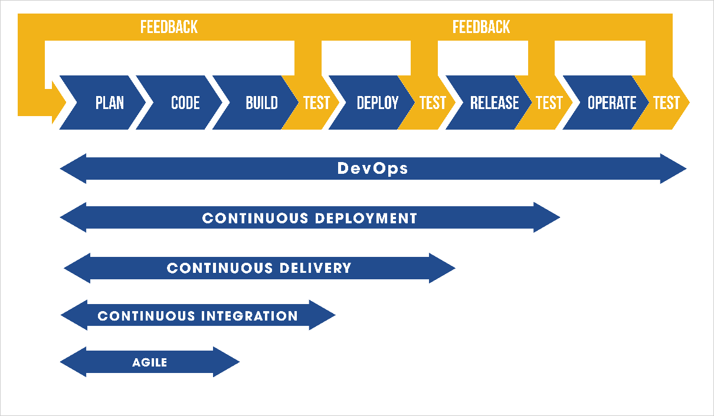
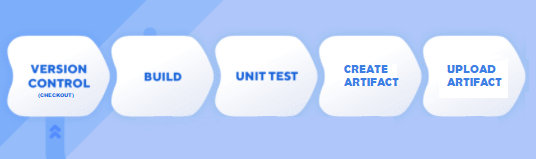
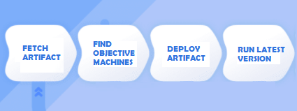
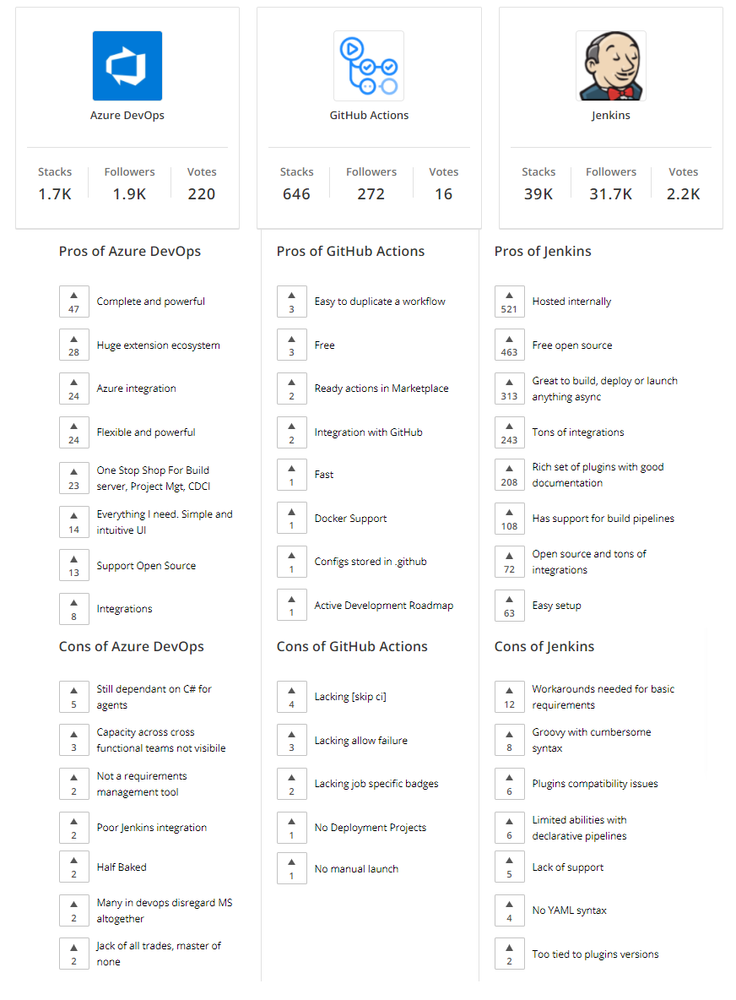

# AnsibleRampupConfig 

Create a VM and install ansible inside. After you need to run your the playbook pointing to the bastion host using Ansible to install Jenkins.

## Related Repositories

App:

- [UI](https://github.com/jeisonroa1/movie-analyst-ui)
- [API](https://github.com/jeisonroa1/movie-analyst-api)

Infra and config:

- [On Premise Approach using Vagrant](https://github.com/jeisonroa1/OnPremiseVagrantInfra)
- [Terraform Approach using AWS](https://github.com/jeisonroa1/TerraformAWSInfra)

## Preparing

- Edit line 13 of the 'provision.sh' file adding the real IP of your bastion host.

- Edit Playbook.yml with real 'login_host', 'login_user', 'login_password'  variables.

## Running

To build the virtual machine (Ansible Server) run:

> vagrant up

To connect via ssh run:

> vagrant ssh ansible

If you need to run the playbook run:

> ansible-playbook playbook.yaml

## Configuring Jenkins

- In the new Jenkins, install plugin NodeJS and configure Global tools with the Name: "NodeJs" -> v14.17.0
- Create Pipeline with pooling SCM, Jenkinsfile config and without Lightweight checkout.
- Configure Github repository web hook to work with New jenkins IP.

## Diagrams

### CICD Process

### CI Pipeline

### CD Pipeline

### CICD Tools comparison

