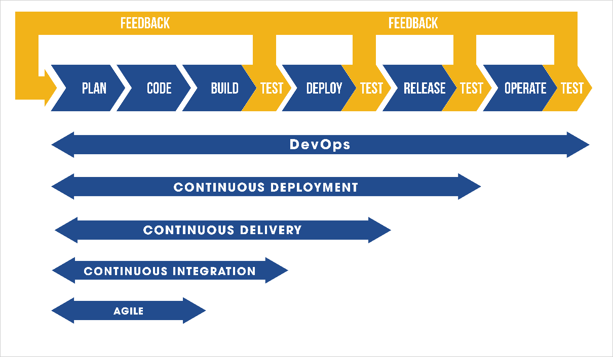
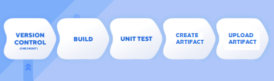
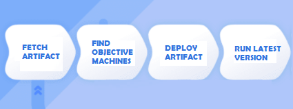
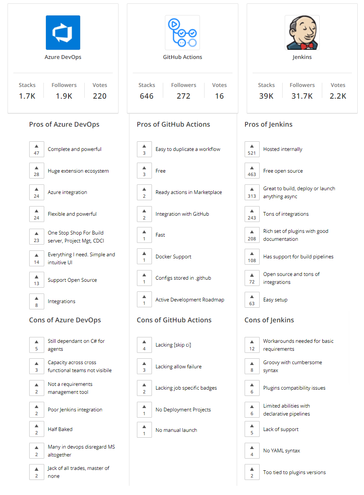
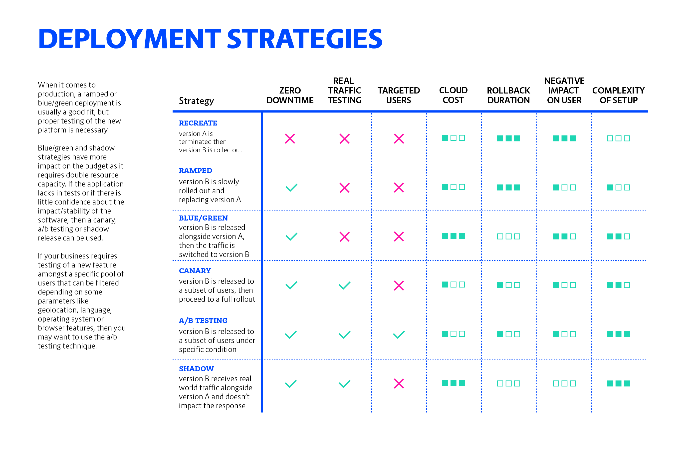

# AnsibleRampupConfig 

Create a VM and install ansible inside. After you need to run your the playbook pointing to the bastion host using Ansible to install Jenkins.

## Related Repositories

App:

- [UI](https://github.com/jeisonroa1/movie-analyst-ui)
- [API](https://github.com/jeisonroa1/movie-analyst-api)

Infra and config:

- [On Premise Approach using Vagrant](https://github.com/jeisonroa1/OnPremiseVagrantInfra)
- [Terraform Approach using AWS](https://github.com/jeisonroa1/TerraformAWSInfra)

## Preparing

- Edit line 13 of the 'provision.sh' file adding the real IP of your bastion host.

- Edit Playbook.yml with real 'login_host', 'login_user', 'login_password'  variables (Line 89).

## Running Ansible Server to Set Up the Bastion Host

To build the virtual machine (Ansible Server) run:

> vagrant up

To connect via ssh run:

> vagrant ssh ansible

If you need to run the playbook run:

> ansible-playbook playbook.yaml

## Configuring Jenkins

- On browser, navigate to <bastionhostip>:8080
- Unlock Jenkins and configure initial setup with "Suggested Plugins".
- Click on "Manage Jenkins" - Plugins - Available.
- Select plugin "Pipeline Utility Steps".
- Select plugin "Pipeline: AWS Steps".
- Select plugin NodeJS.
- Select plugin "Ansible". 
- Click on "Download now and restart after install".
- Click on "Manage Jenkins" - "Configure Global Tools" and add one with the Name: "NodeJs" -> v14.17.0
- Click on "Manage Jenkins" - "Configure Global Tools" and add one with name "ansible" on the location "/usr/local/bin/".
- Click on "Manage Jenkins" - "Configure System" - "Global Properties" and add the global variables for database connection (BACK_HOST, DB_HOST, DB_USER, DB_PASS, DB_NAME).

*CI:
- Create new CI pipelines for both API and UI repositories, with following options:
	--Github hook trigger for GITscm.
	--SCM as Git.
	--Pipeline Script Path: "JenkinsfileCI".
	--Add link to API or UI repo, ending as .git.
	--Disable Lightweight checkout.
- Configure Github repository web hook to work with New jenkins IP.
- Execute pipeline manually once.

*CD:
- Create new CI pipelines for both API and UI repositories, with following options:
	--SCM as Git.
	--Pipeline Script Path: "JenkinsfileCD".
	--Add link to API or UI repo, ending as .git.
	--Disable Lightweight checkout.

## Execution

Execute CI Pipelines:
-On CLI, navigate to both UI and API repositories.
-Commit and push to origin remote. The Pipeline should start.
-Wait for building, tests, artifact creation and artifact upload stages finish.
-Artifacts should be uploaded to S3 bucket.

Execute CD Pipelines
-Should be starts when someone trigger the execution at the end of the CI Pipeline.

## Diagrams

### CICD Process

### Proposed CI Pipeline

### Proposed CD Pipeline

### CICD Tools comparison

### Deployment Strategies

- [For more information click here](https://thenewstack.io/deployment-strategies/)
 

